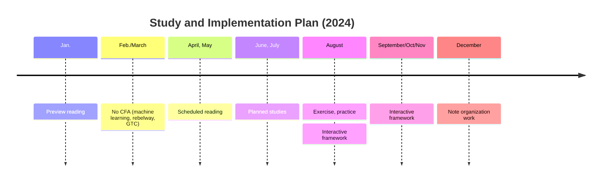

# CFFEMTI

(C)FA, (F)RM, (F)inance, (E)conomics, (M)athematics (exclude statistics, may include probability theory), (T)heories, and (Personal) (I)nvestment, exclude notes on machine learning (go to https://github.com/Charles-Zhang-Deep-Learning/). Keywords: CFA, FRM, Finance, Economics, Mathematics, Theories, Investment.

Objectives:

- [ ] Aug CFA Level 1
- [ ] CFA Comprehensive Visual/Interactive Framework (Observable/Streamlit/Brilliant style)
- [ ] Personal work/finance/wiki/confluence notes reorganization

